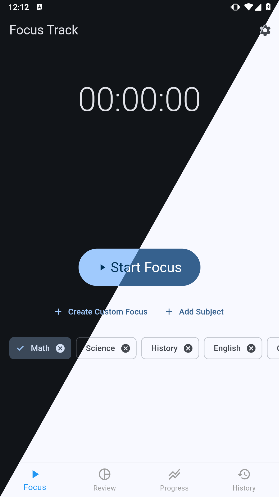
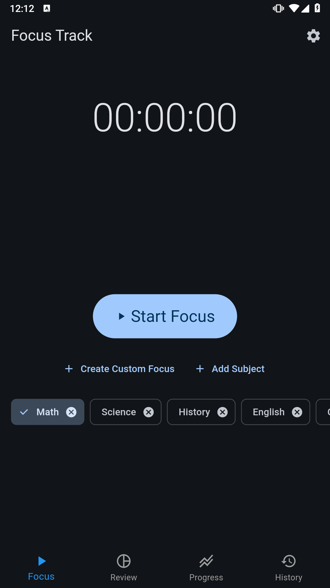
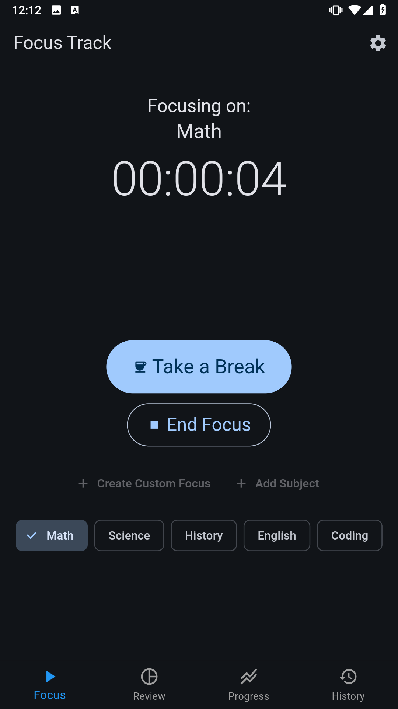
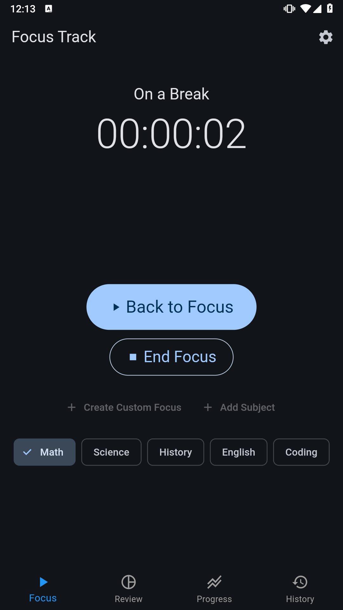
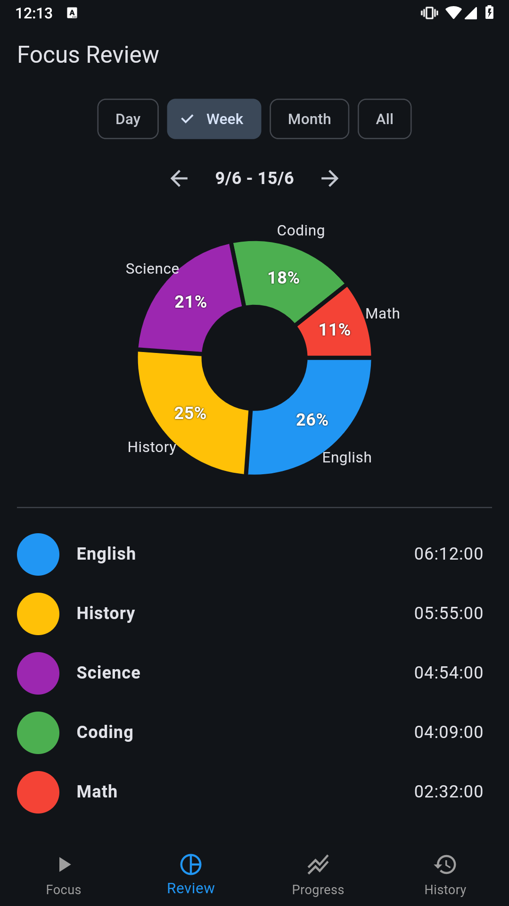
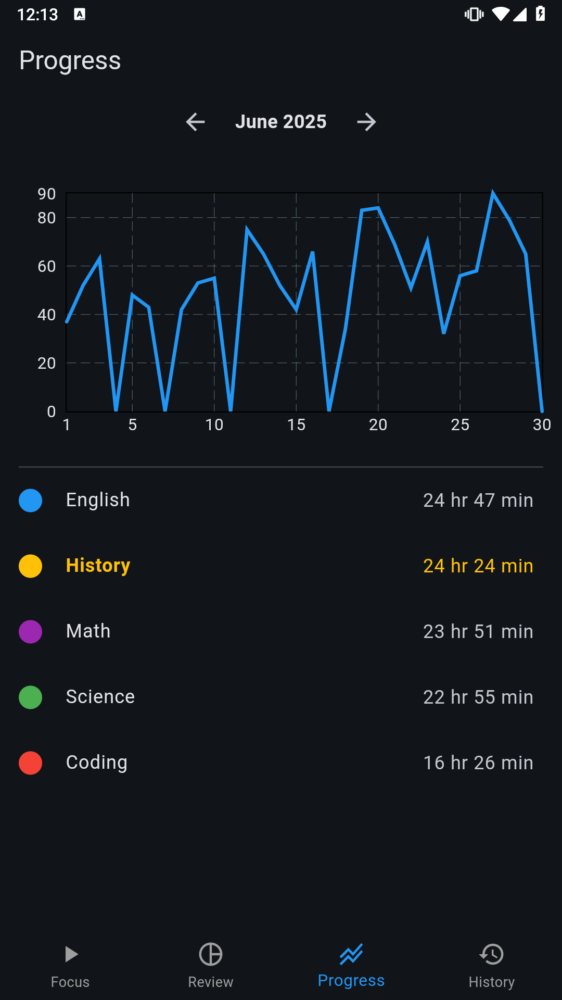
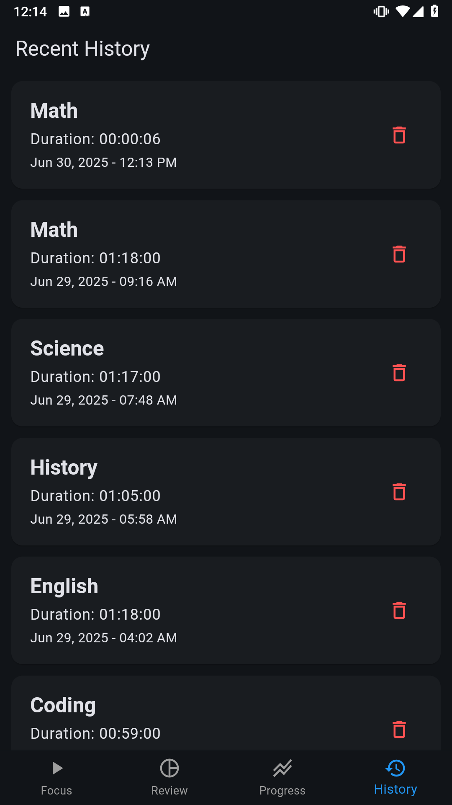
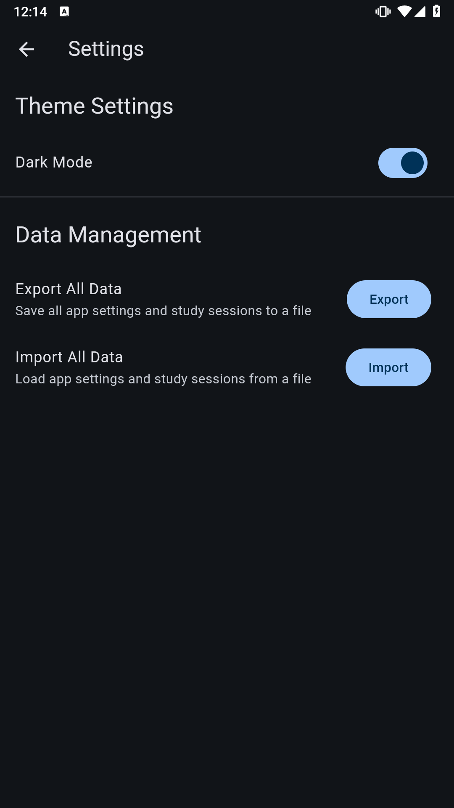

# Focus Track

A productivity application built with Flutter to help you manage and track your study and work sessions. Stay focused, take smart breaks, and review your progress over time.

## ✨ Features

-   **Focus Timer:** Start and end focus sessions with a simple timer.

-   **Integrated Break Timer:** Seamlessly switch to a break timer during your focus sessions to track your rest periods.

-   **Subject Management:** Organize your focus sessions by creating, adding, and removing custom subjects (e.g., Math, Science, Project X).

-   **Custom Session Logging:** Manually add past focus sessions with specific subjects, dates, times, and durations.

-   **Comprehensive History:** View a detailed list of your past study sessions, including subject, duration, and date.

-   **Interactive Review:**

    -   **Overall Review:** See a breakdown of your study time across all subjects using interactive pie charts.

    -   **Subject-Specific Review:** Dive deeper into individual subjects to view total study time, total break time, average session length, and break count.

    -   **Time Period Filters:** Filter your review data by Day, Week, Month, or All Time.

-   **Visual Progress Tracking:**

    -   Visualize your daily study duration over time with line charts.

    -   Filter progress charts by subject to track specific areas.

    -   Navigate through months to see historical progress.

-   **Customizable Theme:** Toggle between light and dark modes to suit your preference.

-   **Data Management:**

    -   **Export Data:** Save all your app data (settings and study sessions) to a JSON file for backup.

    -   **Import Data:** Load previously exported data to restore your app's state.

## 📱 Screenshots

## 🛠️ Technologies Used

-   **Flutter:** The UI toolkit for building natively compiled applications for mobile, web, and desktop from a single codebase.

-   **Hive:** A lightweight and blazing fast key-value database for Flutter and Dart, used for local data persistence of study sessions.

-   **`shared_preferences`:** For persisting simple key-value pairs (like user settings and subject lists).

-   **`fl_chart`:** A powerful Flutter library for drawing various types of charts (Pie Charts, Line Charts) to visualize study data.

-   **`intl`:** For internationalization and localization, used for formatting dates and durations.

-   **`file_selector`:** For picking files from the file system, used for data import/export functionality.

## 🚀 Getting Started

### Installation

Wait for relese 

## 💡 Usage

-   **Focus Tab (Home):**

    -   Select a subject from the chips or add a new one.

    -   Tap "Start Focus" to begin a session.

    -   Tap "Take a Break" to pause your focus and start a break timer.

    -   Tap "Back to Focus" to resume.

    -   Tap "End Focus" to save your session.

    -   Use "Create Custom Focus" to manually add past sessions.

-   **Review Tab:**

    -   View overall study time distribution by subject.

    -   Tap on a pie chart section or subject list item to see detailed statistics for that subject.

    -   Use the "Day", "Week", "Month", "All" chips and navigation arrows to filter data.

-   **Progress Tab:**

    -   See your study duration trend over days in a line chart.

    -   Filter by specific subjects to see their individual progress.

    -   Navigate between months using the arrows.

-   **History Tab:**

    -   Browse a list of your most recent focus sessions.

    -   Swipe left on a session or tap the delete icon to remove it.

-   **Settings Screen:**

    -   Accessed via the gear icon in the AppBar on the Focus tab.

    -   Toggle Dark Mode.

    -   Export all your app data (settings and sessions) to a JSON file.

    -   Import data from a previously exported JSON file.

## 🤝 Contributing

Contributions are welcome! If you have any ideas, suggestions, or bug reports, please open an issue.

## 📧 Contact

For any inquiries or support, please reach out to: `okithmoksha@gmail.com`

## 📄 License

This application is provided for free personal use. The source code is not intended for distribution or modification by users. All rights reserved.
